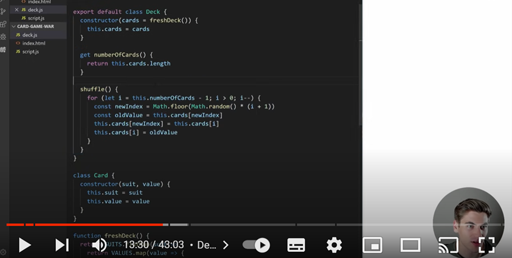

# black-jack
A JavaScript based interactive card game.

## Introduction
I decided to programme a simple JavaScript based Black Jack game, mostly because the rules in principle were fairly simple… or so I thought. After I got deep into the coding of what I though was correct, several people trying out my game pointed out flaws, or things which I needed to add. Following a long stint of internet research and contradictory information pitfalls everywhere, it became apparent that the best decision I could make would be to set out the rules of the game I have set up in a “How to play” section at the beginning. The game, although still called “Black Jack” would rather be better renamed as “Black Jack…ish”.   
It is an enjoyable little game and works entirely as intended (but if you are a card game pedant, you will have to excuse all the inaccuracies). 

## Features (the User Experience)
### Strategy:
The target audience for the Black Jack website is mainly individuals who want to play a simple game against a computer.  
The game has a “How to play” on the first page, detailing the rules governing the game-play, including how to use some of the controls such as “stick” and “twist”. Other options presented to the user throughout the game are explained as they appear.  
A first time, returning or regular user will get a similar experience from the simple game.
 
### Scope:
The important key features are the displayed cards, the incremented scores both for the hand and for the running total of hands won and the buttons for the users control.  
The player is able to continue playing or reshuffle and start again. If they choose to continue, the game will log their score against the dealer's for the number of hands won.
 
### Structure:
The simple game is on a single page of HTML with elements appearing and disappearing as they are or are not required.  
The initial look is the game title, some user options and a simple animated graphic. 
The game play is presented with the dealer cards at the top of the page and the player cards and options at the bottom. A running total of the hands the player and the dealer have won is added on completion of the first hand. 
When player one wins the hand or goes bust, if the dealer can draw more cards to beat them (i.e. in a situation where player one has NOT scored 21 or a “five card trick”), the dealers cards are displayed alongside their total. 
All relevant option screens are presented to the user in the centre of the page.
 
### Skeleton:
The colour scheme, in keeping with the theme of card games, is black, white, red and green. An image of a red card back was selected for the backs of cards. A textured green was selected for the “table” for the cards to go on.  
The colour of the suits of the cards is determined by evaluating the suits.  
Whitesmoke is used for text on the black backgrounds, because it was less harsh, but still created a good contrast.
 
### Surface:

## Technologies
- HTML 5
- CSS 3
- JavaScript

## Deployment to GitHub Pages
Deploy the Black Jack game website to GitHub pages, following these steps:
-	Create a new repository on GitHub for your project
-	Clone the repository to your local machine either by following the on-screen link or by using the command: “git clone https://github.com/ajmccredie/black-jack.git” 
-	Copy the Black Jack Game files to the cloned repository directory.
-	Commit and push changes to the repository.
-	Enable GitHub Pages for your repository by navigating to your repository, clicking on “settings”, scrolling down to “GitHub Pages”, selecting the branch you want to you for the Pages from “source”, clicking “Save”, and then waiting. This may take a few minutes.
-	Your Black Jack game website is now deployed to GitHub Pages and can be accessed via the URL provided in your repository settings.

## Copying or Forking the Project
Copy or fork the Black Jack game project, following these steps:
-	Go to the GitHub repository page of the project
-	Click on the “Fork” button at the top-right hand corner of the page. This creates a copy of the project in your GitHub account.
-	If you want to clone the project to your local machine, click on the “Code” button and copy the repository URL.
-	Open your terminal or command prompt, navigate to the desired directory, and clone the repository using the following command: “git clone https://github.com/your-username/your-forked-repository.git” 
You now have a copy of the Black Jack game project to modify, customise and use as you require.

### Contribution
Contributions to the Black Jack project are welcome! If you have any suggestions, bug reports, or feature requests, please open an issue or submit a pull request in the GitHub repository.
 

## Credits
### Assets:
- Table green Image by <a href="https://www.freepik.com/free-photo/green-textile-texture_1462439.htm#query=green%20felt&position=18&from_view=keyword&track=ais">Freepik</a>
- Card back from https://cutewallpaper.org/24/cards-png/view-page-24.html
- Google Fonts for the fonts imported and used
- Decorative card images in “How to Play” are extracted from <a href="https://www.freepik.com/free-vector/poker-club-game-player-cards-sets-deck-spread-4-aces-royal-flush-hand-realistic-collection-vector-illustration_26764262.htm#page=2&query=playing%20card%203d&position=1&from_view=keyword&track=ais">Image by macrovector</a> on Freepik
- Neon suit symbols from an edited graphic from <a href="https://www.freepik.com/free-vector/casino-card-suit-symbols-neon-colors_15717691.htm#page=2&query=playing%20cards%20symbols&position=12&from_view=keyword&track=ais">Image by starline</a> on Freepik

### Code:
In order to get the project started, I initially really struggled with how to approach building a deck of cards. 
- Creating the deck in script, shuffling it and rendering the cards in CSS and HTML were heavily reliant on "How to build a simple card game with JavaScript" from Web Dev Simplified (https://www.youtube.com/watch?v=NxRwIZWjLtE&t=195s)

- Another video (Code Blackjack with JavaScript HTML CSS (Kenny Yip Coding) (https://www.youtube.com/watch?v=bMYCWccL-3U)) was also found. I watched about the first 10 minutes of  this video, but then stopped because I wanted to explore building the different elements myself and did not want to be too heavily influenced with setting up my gameplay.

- Obtaining socres and manipulating these elements from lessons and the project walk through in Code Institute's Love Maths.

- Creation of the modal "How to Play" adapted from "W3 Schools"

## Testing
### Code validation

### Web developer tools

### Bug fixes
So far as I have been able to find, the game currently runs bug free. There were many bugs to sort along the development journey:
- The game itself was extensively tested, including (as required) with a modified deck. The hardest issue and main source of bugs to get the game working was dealing with the Aces correctly. A log of the bugs and the fixes are shown below.
- The other issues that arose were linked with how to suitably handle running out of cards. This highlighted the issues of holding the shuffled deck as a global variable (done initially due to the large number of functions requiring access to it. Trying to append a new shuffled deck to this did not work, but rather than crashing the programme, was causing no cards to be popped from the end and the deck remaining as 52 cards throughout. To solve this, I utilised the div I had created initially with the intention of using it for game play graphics and to store the shuffled deck there. I tried storing it as a string, but this caused problems for accessing the cards themselves for the game. Creating a deck now appends each card as a separate div within the cards-pile. These are then addressed as child elements and are handled as such. Some refactoring of code to use this new format rather than the previous method of using ‘pop’ to draw cards was required. This fix then allowed for new decks to be made and appended ahead of the remaining cards whenever required (initially coded as automatic and then changed to be a user decision).
- On deployment to GitHub pages, the background and the back of card images did not render correctly. These were fixed by adding two fullstops before the "/" in the file paths.