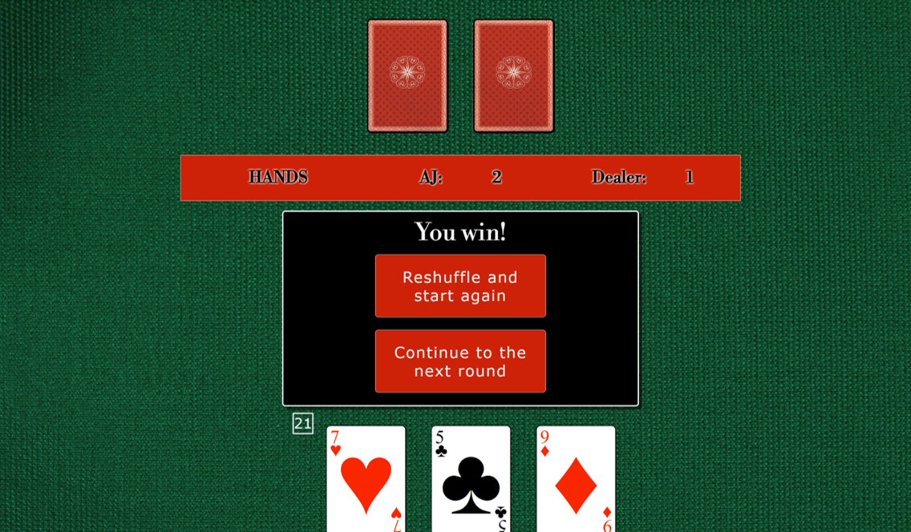
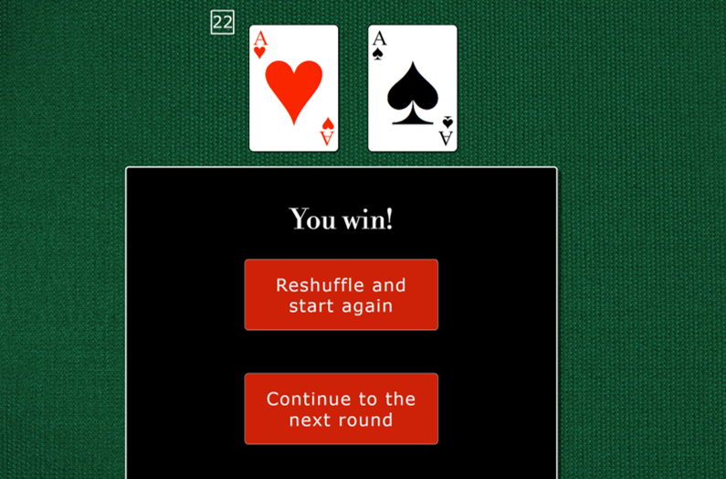

# black-jack
A JavaScript based interactive card game.

## Introduction
I decided to programme a simple JavaScript based Black Jack game, mostly because the rules in principle were fairly simple… or so I thought. After I got deep into the coding of what I though was correct, several people trying out my game pointed out flaws, or things which I needed to add. Following a long stint of internet research and contradictory information pitfalls everywhere, it became apparent that the best decision I could make would be to set out the rules of the game I have set up in a “How to play” section at the beginning. The game, although still called “Black Jack” would rather be better renamed as “Black Jack…ish”.   
It is an enjoyable little game and works entirely as intended (but if you are a card game pedant, you will have to excuse all the inaccuracies). 

## Features (the User Experience)
### Strategy:
The target audience for the Black Jack website is mainly individuals who want to play a simple game against a computer.  
The game has a “How to play” on the first page, detailing the rules governing the game-play, including how to use some of the controls such as “stick” and “twist”. Other options presented to the user throughout the game are explained as they appear.  
A first time, returning or regular user will get a similar experience from the simple game.
 
### Scope:
The important key features are the displayed cards, the incremented scores both for the hand and for the running total of hands won and the buttons for the user's control.  
The player is able to select whether to continue playing, or reshuffle and start again. If they choose to continue, the game will log their score against the dealer's for the number of hands won.
 
### Structure:
The simple game is on a single page of HTML with elements appearing and disappearing as they are or are not required.  
The initial look is the game title, some user options and a simple animated graphic. 
 
 
The "How to Play" is in the form of a pop-up, which can be dismissed once read. This is important, because the game follows a fairly unique set of rules, and this is the communication to player of how to expect the game to behave.  

 
The user is asked to enter their name, but an alternative default of "Player One" is offered. 

The game play is presented with the dealer cards at the top of the page and the player cards and options at the bottom. The player is able to "Stick" (therefore declaring their hand), "Twist" (request an additional card to add to their hand), or "Exit game and return to start" (which refreshes the page and entirely restarts the game, allowing the player access to the "How to play" or to change their name if they choose to play again) 

A running total of the hands the player and the dealer have won is added on completion of the first hand. 
 
If the player selects to "reshuffle and start again", the game produces a new 52-card deck and zeroes the running totals whilst continuing to display the names as before.  
 
When player one wins the hand or goes bust, if the dealer can draw more cards to beat them (i.e. in a situation where player one has NOT scored 21 or a “five card trick”), the dealers cards are displayed alongside their total. 

 
The dealer draws more cards, and their hand is shown, if the player has not already won with 21 or a five card trick. This can result in the dealer gaining a higher score and winning, obtaining a five card trick themselves, or going bust.
 
 
When the cards that were generated for a 52-card deck are exhausted, the player is presented with an option to restart or to add a freshly shuffled deck and continue. If they restart, the game is reloaded, but if they choose the freshly shuffled deck, the user name and progress are retained and they can continue playing as before.
 
 
All relevant option screens are presented to the user in the centre of the page.
 
### Skeleton:
The colour scheme, in keeping with the theme of card games, is black, white, red and green. An image of a red card back provides the back of the cards. A textured green background provides the “table” for the cards to go on.  
The colour of the suits of the cards is determined by evaluating the suits, withe red allocated to hearts and diamonds, and black to the clubs and spades.  
Whitesmoke is used for text on the black backgrounds, because it is less harsh than plain white, but still creates a good contrast.
 
### Surface:
The visual hierarchy of the site maintains consistency, with the dealer cards always at the top and the player cards always at the bottom of the page.  
The fonts are selected for two reasons: to maintain the look and feel of elegance and opulence of casinos, and to allow clear communication and instruction for user interactive buttons.  
The animated graphic on the welcome screen is to provide a mild form of entertainment while the user selects which option they wish to follow. The images again infer the neon lighting of casinos.  
Buttons for the user are all shown in red, with the exception of the 'close' 'x' in the corner of the 'How to play' (which is white, but does change to red when the user hovers over it). This consistent style aids useability and makes the game feel more intuitive and familiar. 
The CSS has been written to allow for responsiveness over a variety of screen sizes, including mobile and tablet screens.  
https://ui.dev/amiresponsive?url=https://ajmccredie.github.io/black-jack/ shows the different views in preview:

The user will encounter the included features in a manner similar to the order detailed in the "Structure" description.

## Technologies
- HTML 5
- CSS 3
- JavaScript

## Deployment to GitHub Pages
Deploy the Black Jack game website to GitHub pages, following these steps:
-	Create a new repository on GitHub for your project
-	Clone the repository to your local machine either by following the on-screen link or by using the command: “git clone https://github.com/ajmccredie/black-jack.git” 
-	Copy the Black Jack Game files to the cloned repository directory.
-	Commit and push changes to the repository.
-	Enable GitHub Pages for your repository by navigating to your repository, clicking on “settings”, scrolling down to “GitHub Pages”, selecting the branch you want to you for the Pages from “source”, clicking “Save”, and then waiting. This may take a few minutes.
-	Your Black Jack game website is now deployed to GitHub Pages and can be accessed via the URL provided in your repository settings.

## Copying or Forking the Project
Copy or fork the Black Jack game project, following these steps:
-	Go to the GitHub repository page of the project
-	Click on the “Fork” button at the top-right hand corner of the page. This creates a copy of the project in your GitHub account.
-	If you want to clone the project to your local machine, click on the “Code” button and copy the repository URL.
-	Open your terminal or command prompt, navigate to the desired directory, and clone the repository using the following command: “git clone https://github.com/your-username/your-forked-repository.git” 
You now have a copy of the Black Jack game project to modify, customise and use as you require.

### Contribution
Contributions to the Black Jack project are welcome! If you have any suggestions, bug reports, or feature requests, please open an issue or submit a pull request in the GitHub repository.
 

## Credits
### Assets:
- Table green Image by <a href="https://www.freepik.com/free-photo/green-textile-texture_1462439.htm#query=green%20felt&position=18&from_view=keyword&track=ais">Freepik</a>
- Card back from https://cutewallpaper.org/24/cards-png/view-page-24.html
- Google Fonts for the fonts imported and used
- Decorative card images in “How to Play” are extracted from <a href="https://www.freepik.com/free-vector/poker-club-game-player-cards-sets-deck-spread-4-aces-royal-flush-hand-realistic-collection-vector-illustration_26764262.htm#page=2&query=playing%20card%203d&position=1&from_view=keyword&track=ais">Image by macrovector</a> on Freepik
- Neon suit symbols from an edited graphic from <a href="https://www.freepik.com/free-vector/casino-card-suit-symbols-neon-colors_15717691.htm#page=2&query=playing%20cards%20symbols&position=12&from_view=keyword&track=ais">Image by starline</a> on Freepik

### Code:
In order to get the project started, I initially really struggled with how to approach building a deck of cards. 
- Creating the deck in script, shuffling it and rendering the cards in CSS and HTML were heavily reliant on "How to build a simple card game with JavaScript" from Web Dev Simplified (https://www.youtube.com/watch?v=NxRwIZWjLtE&t=195s)

- Another video (Code Blackjack with JavaScript HTML CSS (Kenny Yip Coding) (https://www.youtube.com/watch?v=bMYCWccL-3U)) was also found. I watched about the first 10 minutes of this video, but then stopped because I wanted to explore building the different elements myself and did not want to be too heavily influenced with setting up my gameplay.

- Obtaining scores from the DOM and manipulating these elements from lessons and the project walk through in Code Institute's Love Maths.

- Creation of the modal "How to Play" adapted from "W3 Schools"

- Encouragement to break down the larger functions into smaller, reusable functions from mentor Mitko Bachvarov.

## Testing
### Code validation
The code was passed through validators for the CSS, HTML and JavaScript.
- CSS

- HTML

- JavaScript

### Feature test log for final deployed version
| Feature | Behaviour | Pass or fail?  (Edge, Firefox  and Safari) |
| -------------- | -------------- | -------------- |
| Load screen animation  | Images fit within bar and appear and disappear according to the timings in the code. Animation does not affect the general running of the screen.   | Pass   |
| How to play pop-up  | Pop-up loads on top of existing screen, displays words and graphic responsively and clearly.  Close 'x' for the pop-up clear and works as expected.   | Pass   |
| Initial buttons for set up | Both the "Let's Play!" and "How to Play" buttons display clearly and work on first click.   Buttons direct user to the place they are expecting.   | Pass   |
| Adding names (maximum 12 characters)  | The system alert pop-up appears when the player presses "Let's Play".  The player is asked to enter a name, but a default value of "Player One" is available for those who would rather not enter information here.  The user is warned not to enter more than 12 characters, but they are not prevented from doing so.  Characters beyond the 12 character limit are cut off in the player name display.  User name is displayed with their running score.   | Pass   |
| Dealer behaviour  | If the player goes "bust", scores 21, or a five card trick, the dealer does nothing when "stick" is pressed by the player (cards stay facing down and no additional cards are drawn)  If the player sticks on fewer than 21 points, the dealer will continue to draw cards until they score more than the player, or go bust. These cards and the running total of their hand are shown.   | Pass   |
| Live hand score  | The player one score is shown and changes with each new card on "twist".  The total reflects an accurate valuation of the cards (numerical values of cards, all picture cards valued at 10, and aces at 11 or 1 depending on whether the total score is greater than 21).  The value is displayed clearly and helps users to understand their score.  Dealer score is hidden until the player "sticks".   | Pass   |
| Running score of the number of hands won by each | This section appears after the first hand is played. The section remains in place if the user opts to "Reshuffle deck and start again", where it keeps the names, but resets the score to zero.   | Pass   |
| End of deck options  | When the game runs out of the 52 cards generated for a deck, it offers a choice to exit the game and start again (which reloads the game and requires a new user name to be entered) or to add on a new, freshly shuffled, deck.  Selection of a new deck retains all other features (current cards in play, user name and running total).   | Pass   |
| Exit game and start over  | When clicked the user is taken straight back to the welcome page and will be required to re-enter their name when they want to play.  The user has full access to all features which were available to them initially.   | Pass   |

### Web developer tools
#### Lighthouse
The results for the game from Lighthouse are shown:

The page accessibility scored 100.

### Bug fixes
So far as I have been able to find, the game currently runs bug free. There were many bugs to sort along the development journey:
- The game itself was extensively tested, including (as required) with a modified deck. The hardest issue and main source of bugs to get the game working was dealing with the Aces correctly. A log of the significant bugs and the fixes are shown below.

| Bug Description | Screenshot | Fix |
|-----------------|------------|-----|
| The "end of hand" dialogue was appearing twice  |   | Located and removed the duplicate call in the script.  |
| Both values for the aces counting as '11' on the initial draw  |   | If statement added to catch the scenario of both cards being aces and to give the total as '12' not '22' |
| Subtracting 10 too many times when ace is not the final card drawn. This took a while to work out the root cause because it manifested in different ways (as shown in the screenshot), where the winner would not be correctly calculated, and the scores were wrong.  | Example 1 where the player is not bust, but should be Example 2 where the player has been able to draw far too many cards on "Twist" Incorrect five card trick calculation  Dealer drawing too many cards | After a number of different fix attempts and a while to fully implement, Boolean indicators were added to the card descriptors to allow aces which had already been used to discount 10 from the total to be classed as 'used' and discarded from future subtractions. |
| Double aces calculating as zero at the start of the game.  |   | The code used for the dealer (which worked) was used for the player code too.  |
| Dealer unnecessarily drawing additional cards when the player has scored 21 and therefore already won.  |   | The code was changed to automatically announce the player as having won if they "Stick" on a score of 21. The dealer cards also stay hidden.  |
| Double pop-up generated, which would confuse the user. It also clutters the screen. |   | The code was refactored to keep the backs of the cards facing the player and not to draw more cards in scenarios where Player One had chosen to "Stick" on a score of 21.  |
| New deck not generating following query.  |   | No new deck because error generated before alert – fixed using a setTimeout(function() { newDeckQuery(); }, 0); after researching issue on stack overflow  |
| Dealer does not draw more cards, despite the player having less than 21 and the dealer having the same score as the player so far.  |   | The code was refactored to look for the dealer hand to be "less than or equal to player one's" (and below 21), rather than the previous "less than".  |
| Images not rendering when first deployed to GitHub  |   | Adding two full-stops before the "/" in the file paths.  |
| Double message generation for five card trick  |   | Code duplication found and removed.  |
| When the option to change the username was added, no validation or back-up were in place, so user could entirely delete the name. |   | Whilst this could have been fixed with validation, because the game is so short and to not inconvenience the user, a default of "Player One" has been added to replace a blanked or spaced input.  |
| "Stick" and "Twist" buttons still operational when the new deck query is shown. Clicking on either button caused the system to generate another new deck query. These could be clicked repeatedly.  | Unavailable (was reported by a friend testing the programme)  | "Stick" and "Twist" buttons removed from DOM while new deck query is presented. |

 
- The other issues that arose were linked with how to suitably handle running out of cards. This highlighted the issues of holding the shuffled deck as a global variable (done initially due to the large number of functions requiring access to it). Trying to append a new shuffled deck to this did not work, but rather than crashing the programme, was causing no cards to be popped from the end and the deck remaining as 52 cards throughout. To solve this, I utilised the div I had created initially with the intention of using it for game play graphics and to store the shuffled deck there. I tried storing it as a string, but this caused problems for accessing the cards themselves for the game. Creating a deck now appends each card as a separate div within the cards-pile. These are then addressed as child elements and are handled as such. Some refactoring of code to use this new format rather than the previous method of using ‘pop’ to draw cards was required. This fix then allowed for new decks to be made and appended ahead of the remaining cards whenever required (initially coded as automatic and then changed to be a user decision).

## Ideas for future developments (currently beyond the scope of this project)
I set out and succeeded in building a simple interactive card game which gave the user options and logged the score throughout.
Possible future developments, using this code as a starting point, could include:
- The ability to "split hands" if the player has drawn two cards of identical value (for example, two fours or two kings).
- The addition of one more extra computer controlled "players" (whose behaviour could be pseudo-randomised using probability and if/else statements).
- The ability of the player to select an avatar from a small selection and/or to "choose" the dealer from a list of names and avatars.
- The ability to change the design on the back of the cards.
- The addition of some form of in-game "currency" and the ability to place wagers.